# My Secure Home - User’s Manual

- [TL;DR](#tldr)
- [Why This App?](#why-this-app)
- [Installation](#installation)
    - [iOS](#ios)
    - [Android](#android)
- [Account Management](#account-management)
    - [Registration](#registration)
    - [Profile Customization](#profile-customization)
    - [Language Selection](#language-selection)
    - [Logout](#logout)
- [Circle / Family Management](#circle--family-management)
    - [Create Circle / Family](#create-circle--family)
    - [Share Circle / Family](#share-circle--family)
    - [Join Circle / Family](#join-circle--family)
    - [Export Locally-cached Passwords](#export-locally-cached-passwords)
- [Family / Circle Features](#family--circle-features)
    - [To-dos](#to-dos)
    - [Events](#events)
    - [Chats](#chats)
    - [Circle Logs](#circle-logs)
    - [Albums](#albums)
- [Contact Us](#contact-us)
- [Clear Cache](#clear-cache)
- [FAQ](#faq)

## TL;DR

"My Secure Home" is an app created by an ex-Facebook engineer who wants to provide the best protection of people's privacy. The permanently-free app is providing social-circle-based collaborative features such as to-do lists, events, chats, albums, and MORE TO COME. This app encrypts all your texts and images using the Advanced Encryption Standard(AES) algorithm and the password that only you possess. It can be downloaded from [App Store](https://apps.apple.com/us/app/my-secure-home/id1470199852) or [Google Play Store](https://play.google.com/store/apps/details?id=com.k8sllc.securehome). Check out the [user's manual](https://blog.shanhuang.net/secure_home/manual.html).

"My Secure Home"是由一位前Facebook工程师创建的手机应用，他希望为人们的隐私提供最安全的保护。这款永久免费的应用程序提供了基于社交圈的协作功能，例如待办事项列表，事件管理，聊天，相册和更多正在开发的功能。此应用程序使用高级加密标准（AES）算法和只有您拥有的密码来加密所有文本和图像。您可以从[App Store](https://apps.apple.com/us/app/my-secure-home/id1470199852)或[Google Play商店](https://play.google.com/store/apps/details?id=com.k8sllc.securehome)下载。您可以查看[用户手册](https://blog.shanhuang.net/secure_home/manual.html)。

---
## Why This App?

As an ex-Facebook engineer, I really hate the fact that giant companies are peeking into everyone's privacy.  I hope there is a tool for everyone in the world that allows them to store their information securely.  At the same time, I want to make the collaborations with small social circles easier.

My Secure Home has a distinct difference that all the texts and images within each social circle is encrypted using the circle password, which makes it impossible to read unless the password is possessed.  This eliminates the possibility of others peeking into your data.

---
## Installation

### iOS

Search for “My Secure Home” on App Store, or use the [download link](https://apps.apple.com/us/app/my-secure-home/id1470199852).

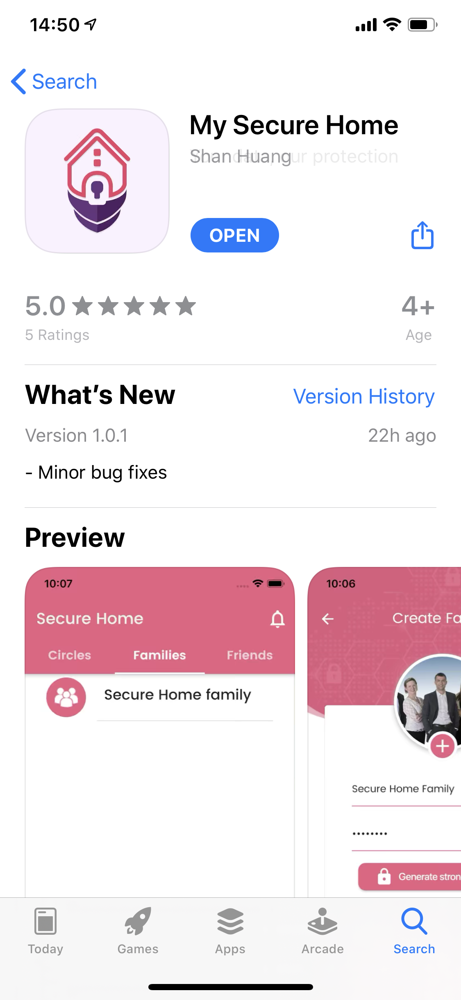

### Android

Search for “Secure Home” in the Google Play Store, or use the [download link](https://play.google.com/store/apps/details?id=com.k8sllc.securehome).

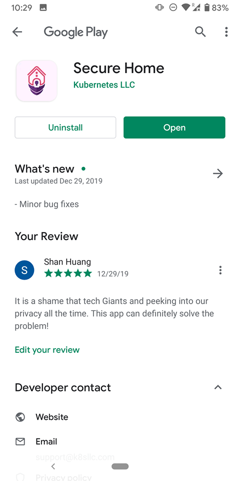


Note our App does not send annoying trash notification at all.  Please grant it permissions when asked! Otherwise, you will lose important features.

---
## Account Management

### Registration

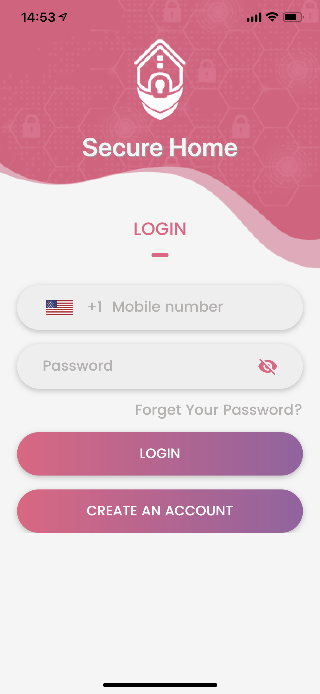

Click "CREATE AN ACCOUNT" at the bottom and you will be guided step-by-step to create your account using your cell phone.  Please be aware that if you don't receive the verification code, please check if you blocked the sender (650) 409-9686.  Contact us support@k8sllc.com if you have problems.

### Profile Customization

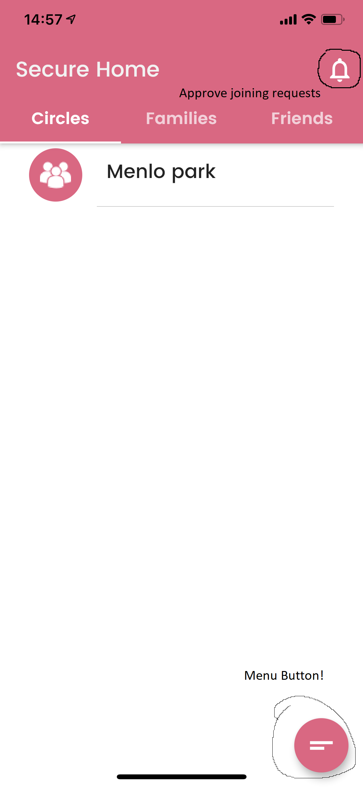

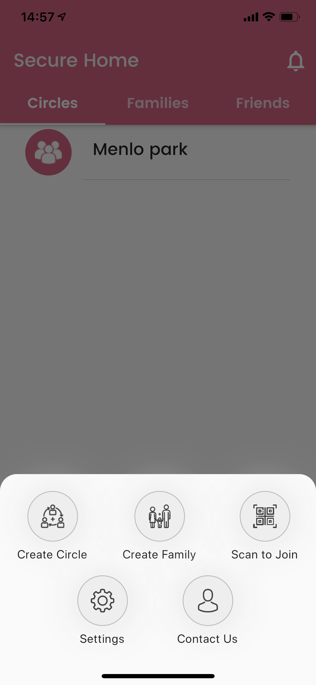


Use the bottom-right button to go to settings page, where you can modify your name, your email, profile picture, etc.

### Language Selection

We support American English and Simplified Chinese.

### Logout

You can log out using the LOGOUT button in the settings page.

---
## Circle / Family Management

There are two types of social circles we support: "Circle" for friends and activities, and "Family" for the real families. At this moment, they have no real differences. But in the future this may change.

### Create Circle / Family

Every normal user can create up to 5 circles / families.  VIP users have much higher limits.

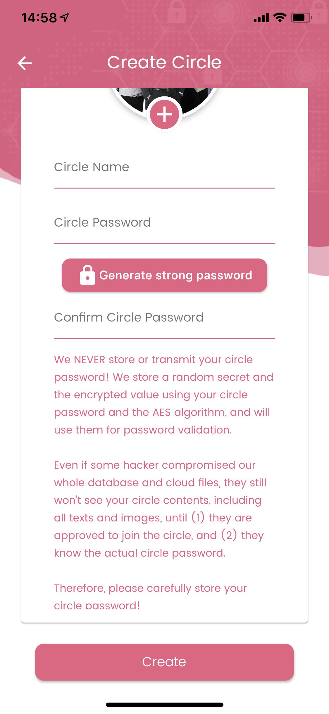

Use the bottom-right button to create a circle / family. During creation, there are two ways to provide the password. You can either provide a strong password by yourself, or use the "Generate strong password" button to generate a new one on your phone (ONLY ON YOU PHONE). When a new password is generated, you can export it to clipboard, or even export as an image.  Please save it.

We NEVER store your circle password! We store a random secret and the encrypted value using your circle password and the AES algorithm, and will use them for password validation. Even if some hacker compromises our whole database and cloud files, they still won't see your circle contents, including all texts and images, until (1) they are approved to join the circle, and (2) they know the actual circle password. Therefore, please carefully store your circle password!

### Share Circle / Family

In the circle / family, you can use the menu to display or export a QR code. Other members would have to scan this QR code to join your circle / family.


### Join Circle / Family

Use the bottom-right button to scan and join the family. You will be prompted to verify the password. If the verification passes, the circle creator will receive a push notification.  They can then approve the joining request.  


Note in this verification step, the circle password is not transmitted online!

### Export Locally-cached Passwords

In the settings menu, you can export locally-cached passwords if you have provided them after logging in.  Note this will only be available after you entered the circle passwords.

---

## Family / Circle Features

### To-dos

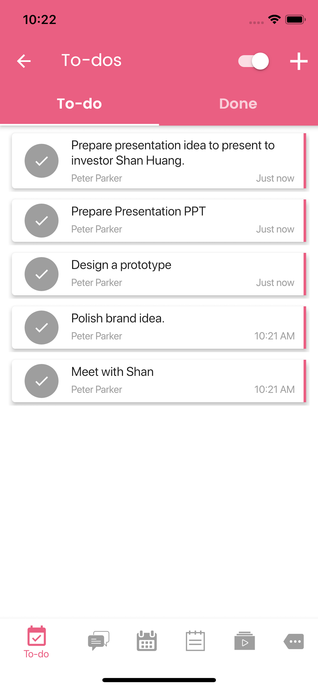

To-dos is a synchronized to-do list for the circle. 

On the top-right of every page, we provide this encryption toggle that allows you to see how your data is stored on the server.

```text
Create to-do: click the top-right "+" button.
Edit to-do: click the to-do item.
Status change: click the button on the left of a to-do item.
Delete a to-do: left swipe on a to-do item, then click delete.
Re-order to-dos: press and hold a to-do item, then drag.
```

### Events

Events is for circle-specific events. The creation is very intuitive.  Note that the events will be automatically synchronized to your device.  On iOS it is synchronized to the "Home" calendar on your iCloud account.  You can update images for an event, which will be encrypted.  You can add locations to events.

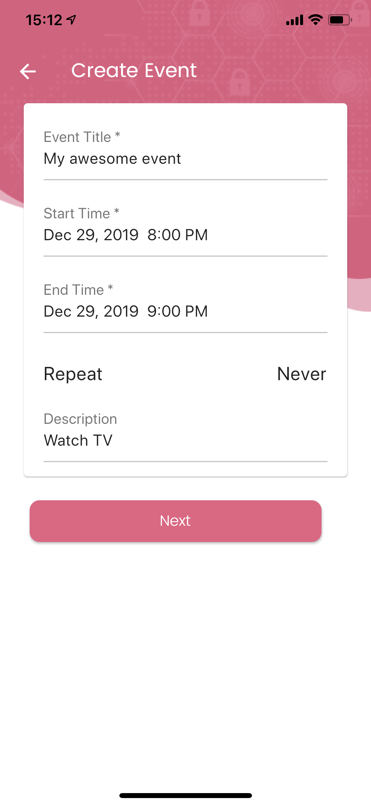
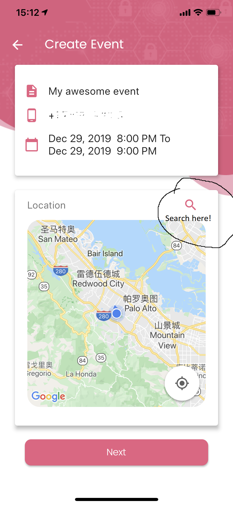
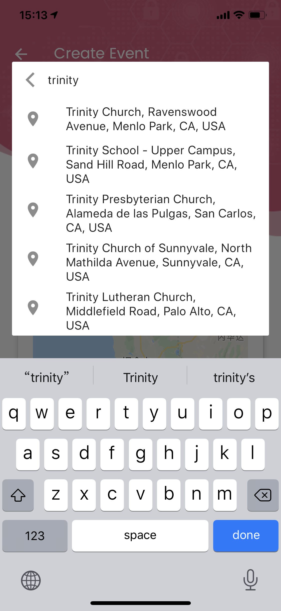
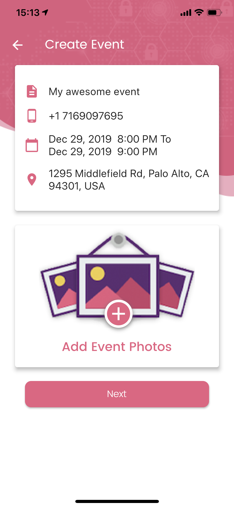

### Chats

Chats are self-explanatory.  Currently, it may feel slower when sending messages because there is some optimization work missing.  However, this will be fixed.

### Circle Logs

You can check out the circle logs to see who has recently modified anything.

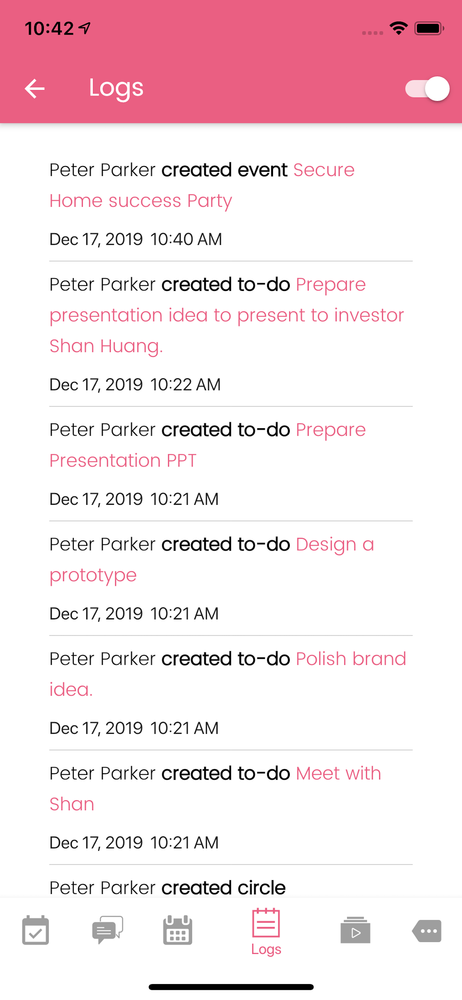

### Albums

We are working on it. It will be out in Jan 2020.

---
## Contact Us

Use the "contact us" button to email us anytime!

---
## Clear Cache

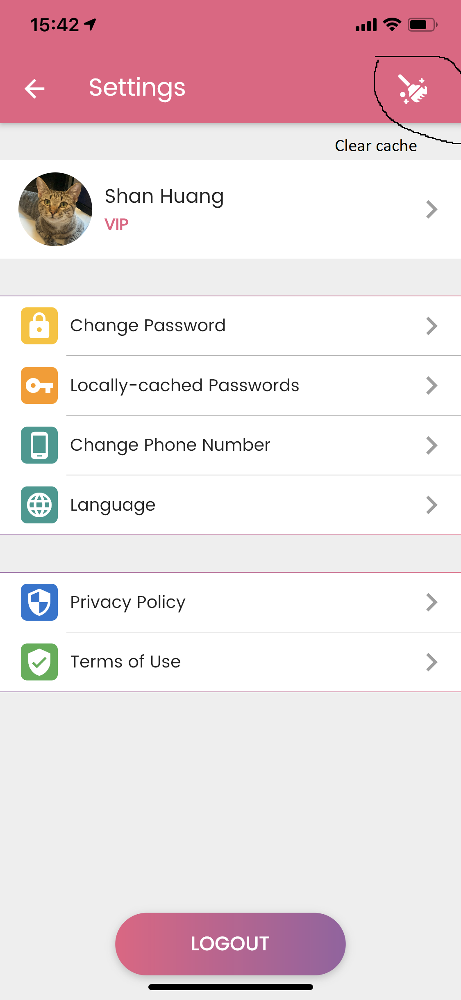

We cache images for faster image loading.  Use the top-right button to clear all local cache!

---
## FAQ

Q: Why do you use the password-based AES symmetric encryption, not an asymmetric encryption?

A: It is possible to solve the problem using an asymmetric encryption. However, there are 3 problems: (1) the asymmetric encryption is much slower than the symmetric encryption; (2) we will need to govern the key exchanges so every client can get the public keys off all other clients, which introduces possibilities of man-in-the-middle attacks in case our code is imperfect; and (3) the clients will be responsible to back up their own private keys, which is even harder than backing up their passwords.

问：你们为什么使用基于密码的AES对称加密，而不是非对称加密？
答：如果要采取非对称加密的方式解决问题，不是不可以，但是有三个难点：(1)非对称加密要比对称加密慢很多；(2)每个client都必须获取其他所有client的公钥，公钥传输的复杂度会提升，而且如果我们服务端出了问题，存在中间人攻击的可能性；(3)客户必须保存备份好自己的私钥，否则信息照样丢失，这件事情比保存密码更难做到。

---

Q: How do I recover the contents if I lose my cell phone?

A: All the contents in our App are backed up in the cloud. If you lose your cell phone, you can still use the original personal phone number and password to login. You will need to type in the cirlce / family passwords to unlock them and find all ontents.

问：如果我丢失了手机，怎么恢复App数据？
答：我们App里面的的所有信息都是云备份的。手机丢失以后，您可以用原来的个人手机号/密码登录账号，再输入圈子/家庭密码就能看到之前所有的信息。

---
Q: What do you store on your servers?

A: All information you can see in the App are stored on our servers. In your circles, you can use the "On server" toggle on the top-right to see which information is encrypted and which is not.

问：你们的服务器存储了哪些信息？
答：所有您能用客户端看到的信息都在服务器上保存。进入圈子内，用右上角的切换按钮可以看到哪些是加密存储，哪些不是。


---
Q: How do I back up my circle/family password?

A: You are responsible for backing up your own passwords. When you join a circle/family, you type in the password and it will be cached locally. In the settings menu you can export locally-cached passwords as images, or copy them to the clipboard and save somewhere. Please back them up if you have not done so! When there are multiple members in the circle, the password is shared, so you can still ask other circle members to get the password.  However, if all members have lost the password, then the information is no longer recoverable.

问：我怎样备份圈子/家庭密码？
答：密码由您自己保存。进入圈子的时候输入一次，然后本机就有缓存。在设置里可以导出本地缓存的密码——可以导成图片或者剪贴板。建议您赶紧备份。如果有多个人在一个圈子，大家是共享这个密码的，所以一个人丢了还可以问别人。如果所有人都把密码丢了，那您的信息就没有了。

